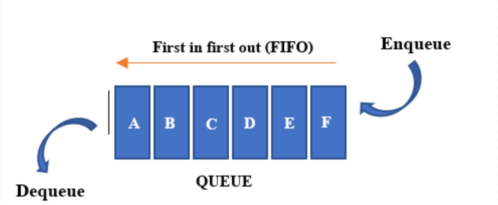

# Queue

A queue is a data structure that follows a 
first in, first out paradigm, or "FIFO" for short.

Let's take an example that we are all familiar with. 
Imagine you've just entered in the checkout line at a 
grocery store. There are ten people in the line ahead of you.
Ask yourself if it would be fair to then jump to the front of
the line and begin laying your groceries on the conveyer belt 
for checkout. Of course, we wouldn't dare do this, as this would 
clearly be unfair to the other ten people who have patiently 
waiting in line before us. The person at the front has waited 
the longest and is the next to check out. The line at the grocery 
store, just like another other line we wait in, follows first in, 
first out. 

Now how can storing and retrieving data act the same way? 
Let's look at the following:

This is a queue. As you can see, the first piece of data that is 
retrieved, or dequeued, from the list was the first one to enter, 
or enqueued, to the list. In Python, a queue is built on a list, 
or a dynamic array. The size of the list is expected to expand 
and shrink as items are enqueued and deqeueued to the list. 
These two methods, coupled with the lists keeping the order of 
its data, uphold the FIFO paradigm. 

Therefore, anytime data is accessed based on the timeline of 
when it was inserted, a queue is used. Be aware that the queue 
is assumed not to be empty when dequeueing.

# Algorithm Effeciency
Since the queue is based on a list, the algorithm effeciencies 
for each procedure will be the same:

| Procedure | Python Syntax | Algorithm Effeciency |
| --------- | ------------- | -------------------- |
| Enqueue | `list.append(item)` | O(1) |
| Dequeue | `list.pop(0)` OR `dq_item = list[0]; del list[0]` | O(n) |
| Queue.length | `len(queue)` | O(n) |

# Example

Let's take a look at one example: ["Simon Says" program](Python_Files/Queue/simon_says.py)

In this program, the computer is randomly picking left, right, 
up, and down sequences that the user has to remember. The steps 
must be repeated back in order. A queue is instantiated as 
`stepping_queue` in line 37. When each random step is generated, 
it is enqueued (line 42). After the user's steps are ordered in 
their own list, each of the user's steps is compared to the correct 
step in order by dequeueing the next correct step for ever user step 
to see if they match, as seen in line 63. This helps with correctly 
incrementing the miss_count for each missed step. 

For more details on how these methods work, refer to the sample Queue 
class definition: [Queue Class](Python_Files/Queue/queue_class.py)

# Problem to Solve

Now it's your turn! You will be creating a program that picks songs at 
random from a text file containing songs that will ensure that no song 
is played again until at least 19 other songs have been played. These 
recently played songs will be placed in a queue. You will need to either 
keep track in the program itself how many items are in the queue or insert 
this logic directly into the Queue class yourself. If you would like to use 
a sample text file for the songs, use [this](Other_Files/queue_example_songs.txt).

HINT: If you want to iterate through each item in the queue, you will need to define 
the "\_\_iter\_\_" macro using the `yield` rather than the `return` keyword.

Check out the solution when finished:

- [Song program solution](Python_Files/Queue/random_shuffle.py)
- [Revised Queue class](Python_Files/Queue/queue_class_solution.py)
