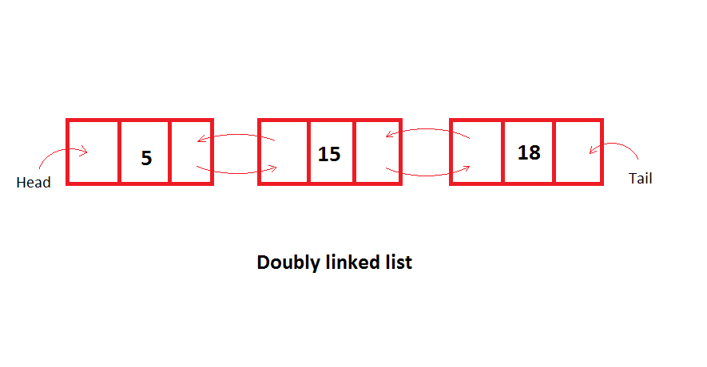

# Linked List

A linked list is similar to the dynamic array in that data is sorted in a linear fashion.
However, rather than having data that is inserted and accessed with an index, a node houses 
the data while containing a pointer that points to the next node, which holds the next piece 
of data. The linked list data structure has a "head" attribute which points to the first node. 
Then, there is the doubly-linked list which in addition to having a head also consists of a "tail" 
attribute which points to the last node. Each node also has a pointer that points back to the 
previous node. This allows for more functionality, such as easily adding a new tail to the linked 
list. Here, we will look at the doubly-linked list. 

In Python, a deque class for working with linked lists is available in the collections library, 
but we will work with our own cusom-made class for increased understanding.

When working with linked lists, there a couple pitfalls to avoid.
For example, when adding the first node to a linked list, it can be easy to forget at this point
that head and tail reference the same node. Additionaly, when adding or removing nodes, do not forget
to update connections surrounding the insertion/deletion. The order that you do this also matters. 
You will get a chance to write a method that adds data into a list at a specific spot based on its
value and learn the 5 steps to undertake in order to properly insert the new piece of data.
Considering the second pitfall above, see if you can come up with those five steps.

# Algorithm Efficiency

| Procedure | Linked List Algorithm Effeciency | Compared to List |
| --------- | -------------------------------- | ---------------- |
| Add node to beginning | O(1) | O(n)
| Remove node at beginning | O(1) | O(n) |
| Add node in the middle | O(n) | O(n) |
| Remove node in the middle | O(n) | O(n) |
| Queue.length | O(n) | O(n) |

As we see here, linked lists have better algorithm efficiencies at the beginning of the data structure
when compared to dynamic arrays, making linked lists the preferred data structure when making a queue 
if you are working with a large amount of data.

# Example

Take a look at the following example: [Automobile Accidents program](Python_Files/Linked_List/auto_accidents.py)

Here, we wanted to test the time it takes to grab the first piece of data in a linked list compared to a normal
list. While lists do have better performance times for smaller sets of data, it was determined that after 
100,000 pieces of data, linked lists become more efficient.

Some methods used from the linked_list class were the 
.add_tail() and .remove_and_return_head() in lines
47 and 20.

As before, refer to the sample Linked List class definition 
for gaining a deeper understanding of the methods used: 
[LinkedList Class](Python_Files/Linked_List/linked_list.py)

# Problem to Solve

Now you will create a program that pulls from a list 
of bank transactions and prints each one while also 
finding the total money spent. If there is a transaction
that is somehow missing, allow the user to input the
missing transaction. The linked list must be ordered by
date and the new transaction must be placed correctly
chronologically.

For convenience you can import everything from the 
[dependencies file](Python_Files/Linked_List/linked_list_dependencies.py)
with   `from linked_list_dependencies import *`
Additionally, you can import the read_auto_accidents
function from the example as the method of extraction
should be the same.

HINT:
2 additional methods are needed
1. insert_data_ordered() - It would be useful to add 
an "add_head()" method if the new transaction needs to
be at the beginning of the linked list.
2. Define an \_\_iter\_\_ for summing and printing each transaction.

Check out the solution when finished to check your work:

- [Bank Transactions solution](Python_Files/Linked_List/bank_transactions.py)
- [Revised LinkedList class](Python_Files/Linked_List/linked_list_solution.py)
