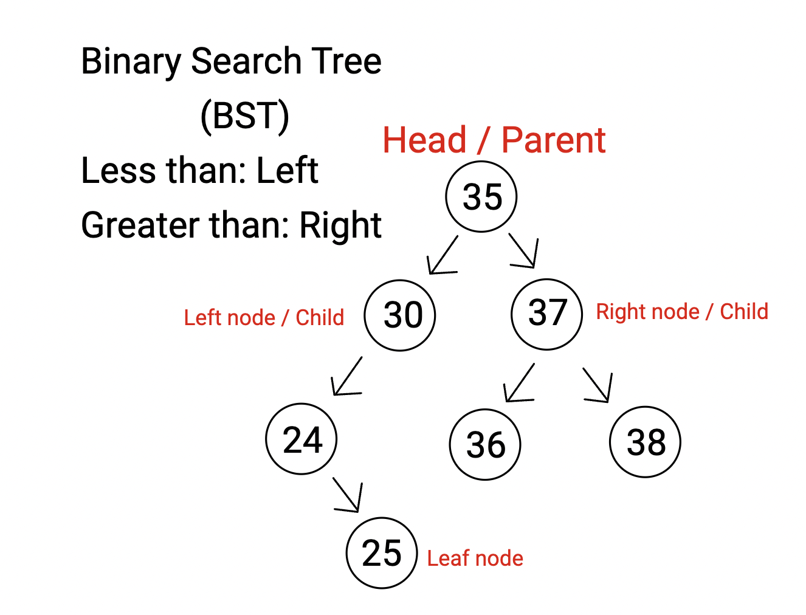

There are three main types of trees:
1. Binary Tree: Like a linked list but nodes point to two nodes, which has its own subtree if it doesn’t terminate into a leaf
2. BST: Data is arranged in a tree according to the size of the data: bigger data goes on the right, smaller data goes on the left
3. Balanced BST: An algorithm is used to assemble the data in a fashion where there is no more than one height difference between any set of leaves. This includes pulling data from the middle of an ordered array first then working on each half

Now it's your turn! Add an updated macro function to the tree class named "\_\_len\_\_" that